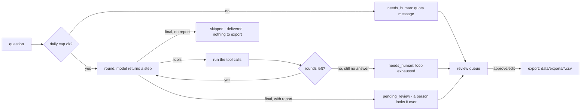

# Portfolio Analyst AI - "The Analyst"

A natural-language analyst over your whole portfolio's data.

## What it does

A natural-language analyst over your whole portfolio's data. Ask it anything - "which property had the best ROAS last month?", "show me pickup by room type" - and it queries the connected data sources, runs its own analysis scripts, renders charts in the chat, and produces board-ready PDFs on demand.

## What it won't do

Answers only from your connected data; when a number isn't there it says so rather than estimating. It reports and explains - it doesn't change rates or settings.

## Why it matters

Owners and GMs shouldn't need a data team (or ten dashboard logins) to get an answer. This turns every portfolio question into a two-minute conversation.

## What to expect

Any portfolio question answered in seconds, with charts and exportable PDFs; live today across a multi-property portfolio.

The roster text above is quoted exactly as it appears on the demo platform's
agent menu - this repo does not promise more than that, and does not promise
less. Two honest narrowings this template makes, spelled out in full in
`docs/how-it-works.md`: it answers for **one property's own connected data**
(see "Design decisions" point 1 - the source system's tools are single-
property too, whatever the roster's "whole portfolio" phrasing suggests),
and "board-ready PDFs" is, honestly, a Markdown report card exported to
CSV/Markdown, not a rendered PDF document (point 5). ROI: **-80%** on "Time
to answer a data question" (labor) - see `docs/benefits.md`.

## Who it's for

Any hotel, restaurant group or small portfolio where the owner or GM
currently pulls numbers by hand - a spreadsheet export, a login to three
different dashboards, a text to the accountant - to answer a question that
should take two minutes. It replaces the "open the PMS, open the finance
sheet, work out the answer" part of that job, not the judgement about what
to do with the answer.

You will get the most from this repo if:

- You already have some way to export daily revenue/occupancy figures (a
  PMS report, an accounting export, even a spreadsheet you keep by hand).
- You have a PMS, or at least a CSV export of your reservations.
- You want an answer in under a minute more than you want a polished
  dashboard - this agent lives in a terminal (or your own Claude Code
  session) by default, not a web app.
- You are comfortable starting on your own Claude Code subscription
  (`llm.provider: interactive`) before deciding whether to pay per token.

It is less of a fit if you need a genuinely live, multi-property comparison
today - every tool here reads one property's data, honestly, and the
"Design decisions" section of `docs/how-it-works.md` says exactly what a
multi-property build would need to add - or if you have no PMS and no plan
to keep even a CSV export current, since the whole point is answering from
real connected data rather than memory.

## How it works

There is no inbox to poll here - the trigger is a question, typed by an
owner or manager. One loop, "ask -> bounded tool loop -> log", not the
"fetch -> dedup -> decide -> draft -> queue" shape most of this family uses:



Seven tools, all in `tools/toolkit.py`, all reads or pure computation over
your own connected data - `get_financial_summary`, `list_reservations`,
`list_pending_emails`, `get_agent_status`, `search_knowledge_base`,
`run_forecast`, `generate_report`. There is no eighth tool that writes
anything to your PMS or your rates - "it doesn't change rates or settings"
(the roster's own words) is enforced by what tools exist, not by a prompt
instruction. Full mechanics, the exact escalation rules, and every design
decision taken where the source system was ambiguous or narrower than the
roster promise: `docs/how-it-works.md`.

### The two modes

| Mode | What happens |
|---|---|
| `shadow` (default) | Every question answers exactly the same way. The scheduled morning digest's export never writes to `data/exports/`. |
| `live` | The digest export runs. Nothing about how a question is answered changes at all. |

### The review queue

Most questions never reach it - a clean answer needs nobody. What lands
here is a question the tool loop genuinely could not answer within its
round budget, or a local daily quota being reached.
`workflows/80-review.md` covers the full loop: list, show, approve, edit,
reject, export.

### What runs when

| Workflow | Cadence | Provider used |
|---|---|---|
| `workflows/10-ask.md` (`tools/run.py --question "..."`) | on demand | whatever `llm.provider` is set to |
| `workflows/16-digest.md` (`tools/run.py --once --digest`) | `config/agent.yaml: schedule.digest` (07:00 daily by default) | whatever `llm.provider` is set to |
| `workflows/80-review.md` (`tools/review.py`) | whenever a human is available | none - queue operations only |

See `docs/how-it-works.md` for the full flowchart, the escalation rules, and
the idempotency guarantees.

## What you need

| Item | Required? | Notes |
|---|---|---|
| A computer or small server that can run Python 3.11+ | Yes | Your laptop is fine to start. |
| A Claude Code subscription, or your own Anthropic API key | Yes | The `interactive` provider uses the Claude Code session you already have open - zero extra cost. See "Run it" below. |
| A daily revenue/occupancy export (`data/imports/financial_daily.csv`) | Recommended | Starts on the bundled Hotel Aurora fixture; connect your own when ready. See "Connect your systems". |
| A PMS, or at least a CSV export of your reservations | Recommended | Starts on `mock` fixtures; the `csv` adapter works with any PMS. |
| A Google Sheet, or nothing at all | Optional | The morning digest export defaults to a local CSV file; a Sheet is a nicer place for a person to read it. |

Time estimate: 5 minutes to see the demo, half a day to connect a real
financial export and fill in your property's `knowledge/` files, a few days
of ad-hoc questions before you would reasonably turn on the scheduled
digest export.

## Quick start (5 minutes, no credentials)

```bash
git clone https://github.com/th1-ai/portfolio-analyst-ai.git portfolio-analyst-ai
cd portfolio-analyst-ai
make setup
make demo
```

You should see something like this:

```
Portfolio Analyst AI demo - 5 sample question(s) from fixtures/inbound/, pretending today is 2026-06-15

  q-financial-summary: "How are we doing this month?" -> tools=[get_financial_summary] status=skipped
      Month to date: EUR 98,589 revenue, up 7.6% on last year, with occupanc
  q-arrivals-today: "Who is arriving today?" -> tools=[list_reservations] status=skipped
      3 arrivals today: Elin Haugen (Family Room, 4 nights, cot requested),
  q-spa-policy: "What's our spa policy for kids?" -> tools=[search_knowledge_base] status=skipped
      The Aurora Spa is for guests aged 16 and over, including the sauna -
  q-weekly-report: "Build me a weekly briefing report with KPIs and a " -> tools=[get_financial_summary, generate_report] status=pending_review
      Weekly briefing built - see the report card above for the KPI tiles a
  q-marketing-spend: "What is our marketing spend by channel this quarte" -> tools=[search_knowledge_base, search_knowledge_base, search_knowledge_base, search_knowledge_base, search_knowledge_base, search_knowledge_base] status=needs_human
      (could not answer - see `python3 tools/review.py show <id>`)

1 of 5 could not be answered cleanly (see docs/safety.md for why that happens).
Nothing was exported: mode is shadow, and generate_report never writes on its own.
Next: `make review` to see anything waiting, or read workflows/10-ask.md.

DEMO OK — 5 items processed, 5 drafted, 0 sent (shadow)
```

That fifth question is deliberately unanswerable in this demo - marketing
spend and ROAS are not connected data in this template, and the Analyst
says so rather than guessing (see "What it won't do" above and
`docs/how-it-works.md`). Every question and answer above is invented - a
fictional "Hotel Aurora" - so you can see exactly how the Analyst thinks
before it ever touches your real data.

Then `make doctor` - expect one `FAIL` (`hotel identity`, because the
property is still the shipped placeholder "Hotel Aurora") and a few `warn`
lines. That is the intended state of a fresh clone; see
`workflows/00-setup.md` for filling in the real property. `make doctor`
also shows `email adapter` and `messaging adapter` as healthy - this agent
does not use either one; that check is shared across every repo in this
family. See `docs/integrations.md`.

## Set up with Claude Code

Open `claude` in this folder. Paste each prompt below in order - Claude will
follow the named workflow file, which tells it exactly which tools to run
and what to check.

**Phase 1 - first run.**

> Read `workflows/00-setup.md` and walk me through it. I have not run this
> agent before.

**Phase 2 - ask a real question.**

> Read `workflows/10-ask.md`. Ask "How is the property doing this month?"
> and walk me through what the Analyst did to answer it.

**Phase 3 - the review queue (once something has escalated).**

> Read `workflows/80-review.md`. Show me what is waiting for me, one at a
> time, and act on my decisions.

**Phase 4 - the morning digest.**

> Read `workflows/16-digest.md` and help me decide whether the standing
> question list fits how we actually want to start the day, then run it
> once by hand.

**Phase 5 - going live.**

> Read `workflows/90-go-live.md`. Go through the checklist with me honestly
> - do not recommend going live until it is genuinely true.

You can also just run the agent directly - `/portfolio-analyst-ai` in this
folder runs the main workflow and works the queue in one command; see
`.claude/skills/portfolio-analyst-ai/SKILL.md`.

## Connect your systems

Full detail, including the "implement your own" recipe, is in
`docs/integrations.md`. This section covers only what Portfolio Analyst AI
itself uses.

### PMS - `systems.pms.adapter` in `config/hotel.yaml`

| Adapter | Status | Needs |
|---|---|---|
| `mock` | universal | nothing - reads `fixtures/hotel/reservations.json` |
| `csv` | universal | a CSV export in `data/imports/` - works with any PMS |
| `cloudbeds` | built | `CLOUDBEDS_CLIENT_ID`, `CLOUDBEDS_CLIENT_SECRET`, `CLOUDBEDS_REFRESH_TOKEN`, `CLOUDBEDS_PROPERTY_ID` |
| `cli` | universal | `PMS_CLI_COMMAND`, `PMS_CLI_PROFILE` - a JSON-speaking vendor CLI |

Read only - `list_reservations` is the only tool that touches it, and there
is no PMS-write anywhere in this agent.

### Financial ledger - `data/imports/financial_daily.csv`

Not a `core/adapters` family - a plain CSV, one row per day:
`date, revenue_rooms, revenue_fnb, revenue_other, costs_total,
occupancy_pct, adr, rooms_available`. Falls back to the bundled Hotel
Aurora fixture (two years of invented daily data) when the file is absent.
Feeds `get_financial_summary` and `run_forecast`. See
`docs/integrations.md`.

### Guest email snapshot - `data/imports/guest_emails.csv`

Feeds `list_pending_emails`. Columns: `id, from_name, subject,
classification, confidence, status, summary, received_at`. If you run a
guest-comms agent alongside this one, export its inbox status here on a
schedule - this repo has no hidden dependency on another repo's database.

### Agent fleet snapshot - `data/imports/agents_fleet.csv`

Feeds `get_agent_status`. Columns: `slug, name, nickname, status,
runs_today, runs_30d, success_rate, last_run_at`.

### Knowledge base - `knowledge/*.md`

Feeds `search_knowledge_base`. Copy the `knowledge/*.example.md` files, fill
them in with your own property facts, policies and FAQ - see
`knowledge/README.md`.

### Sheets - `systems.sheets.adapter`

| Adapter | Status | Needs |
|---|---|---|
| `csv` | universal | nothing - writes `data/exports/*.csv` |
| `google` | built | `GOOGLE_SHEET_ID`, `GOOGLE_SERVICE_ACCOUNT_FILE` |

Used by the morning digest export (`workflows/16-digest.md`) and by
`tools/review.py send`.

### Everything else

`email`, `messaging`, `pos`, `accounting`, `reviews`, `calendar`,
`payments`, `procurement` and `locks` are **stubs** (or, for email and
messaging, the always-green `mock` adapter) in `core/adapters/` - Portfolio
Analyst AI does not use any of them itself. If your own workflow needs one
(a real accounting-system tool, say), `docs/integrations.md` has the
five-step "Implement your own" recipe.

Check what is actually working on your machine at any time:

```bash
make doctor
```

## Run it

```bash
make run ARGS='--question "How are we doing this month?"'   # ask one question
python3 tools/run.py --once --question "Who is arriving today?"
make run ARGS="--digest"                                     # the morning briefing, once
python3 tools/run.py --watch --digest                         # keep the digest running
make run ARGS='--question "..." --dry-run'                   # compute the answer, write nothing
```

**Scheduling.** `scheduler/crontab.example`, `scheduler/launchd.example.plist`
and `scheduler/systemd.example.service` plus `scheduler/systemd.example.timer`
already show this agent's one real job - the morning digest at 07:00
(`tools/run.py --once --digest`) - copy the one for your machine and fill in
the repo path. To generate a fresh one with your own absolute paths already
filled in instead:

```bash
python3 tools/schedule.py --all
```

which reads `config/agent.yaml: schedule:` and prints the right command
already filled in for the `digest` job.

**Subscription or API.** `llm.provider: interactive` or `claude-code` runs
on the Claude Code subscription you already pay for - genuinely the
cheapest way to run this agent, with the caveat that Anthropic's usage
policy governs automated use of a personal subscription (a handful of
scheduled digest runs a day plus ad-hoc questions is normal; hammering it
around the clock is not). `llm.provider: anthropic` uses your own API key,
bills per token, and is the right choice once questions are a normal part
of how the portfolio runs. `make report` shows what you are actually
spending either way - see `docs/safety.md` for the full honest note.

## Go live

Shadow mode is the default and stays the default until you change it.
Answering questions works identically in both modes; the only thing `mode:
live` changes here is whether the morning digest actually exports. The full
checklist - real config filled in, real financial data connected, a few
days of real questions behind you - is in `workflows/90-go-live.md`. In
short:

```yaml
# config/hotel.yaml
mode: live
```

`review.require_approval_for` does not list `sheets_write` (the digest
export) by default - going live means the digest starts exporting on its
own schedule, without a per-day approval, unless you add `sheets_write` to
that list first. Going back to shadow (`mode: shadow`, or `AGENT_MODE=shadow`
in `.env` for one run) stops the export immediately, mid-schedule - questions
keep answering exactly as before either way.

## Guardrails & safety

Full detail in `docs/safety.md`. The short version:

**What it will never do.**

- Change a rate, a room status, a reservation, or anything else in your
  PMS - there is no write method anywhere in this agent's tool set.
- Send anyone outside the person asking a message on its own - there is no
  email or messaging adapter in this agent's own code path at all.
- Take a payment, issue a refund, or move money.
- State a number that did not come from a tool call. When a fact is not in
  your connected data, it says so plainly instead of estimating - see
  `fixtures/inbound/question-05-marketing-spend.json` for a worked example.
- Answer forever, or past its local daily quota - both escalate to
  `needs_human` rather than loop or guess.

**Data handling.** Everything lives in `data/agent.db` on your own machine -
there is no cloud service behind this repo. With `llm.provider: anthropic`
or `claude-code`, the question and whatever tool results the model asked
for go to Anthropic; with `mock` or `interactive`, nothing leaves the
machine at all. `privacy.retention_days` controls how long processed items
stay in the database.

**Who this agent talks to.** The person asking is your own staff, never a
guest - so the `hotel.languages` reply-language guardrail this family
enforces on guest-facing agents does not apply here structurally; this
agent has no guest-facing send path at all. See `docs/safety.md`.

**AI disclosure (EU AI Act Article 50).** Close to automatically satisfied
here - the person asking types a command or reads a labelled digest, so
there is no ambiguity that software answered. If you build a chat surface
on top of this agent for people other than the owner/GM, tell them plainly,
the same way any other agent in this family does for guests.

## Customising

**`knowledge/`** - `knowledge/property.md` and `knowledge/faq.md` are what
`search_knowledge_base` answers property questions from. Add more markdown
files to the folder freely; every real file there (not one of the shipped
`knowledge/*.example.md` templates) is indexed - see `docs/integrations.md`.

**`prompts/ask.md`** - the one prompt every round of the tool loop uses.
Plain markdown with `{{hotel_name}}`, `{{persona_name}}`,
`{{hotel_currency}}` and `{{tool_list}}` placeholders (`core/templates.py`).
Edit the tone, the mandatory-tool rules, or the data-truthfulness wording
directly - the same prompt is used by every provider, so the `interactive`
mode is always a faithful preview of what `claude-code`/`anthropic` would
see.

**`config/agent.yaml`** - every knob is commented in
`config/agent.example.yaml`: `persona.name`, `tool_loop.max_rounds`,
`rate_limit.max_questions_per_day`, `digest.questions`,
`forecast.trailing_days` / `forecast.max_days`, `reservations.max_rows`,
`knowledge_search.top_k`, `schedule.digest`.

**Adding a language.** This agent answers in whatever language the question
was asked in, at the model's own discretion - there is no fixed intents
list or language-detection step to configure, unlike a guest-facing agent
in this family. If you want the Analyst to always answer in a specific
language regardless of how the question was phrased, add a line to
`prompts/ask.md`'s System section: `Always answer in {{hotel_languages}}'s
first language, regardless of the question's language.`

**Adding a tool.** A new connected data source needs a matching entry in
`tools/toolkit.py: TOOL_SPECS` and a function in `TOOL_FUNCS` - follow the
shape of the seven already there (a `ToolContext` in, a JSON-safe dict out,
raise `ToolError` for bad arguments). See `docs/integrations.md` "Implement
your own".

## Troubleshooting & FAQ

Full list: `workflows/99-troubleshooting.md`. The most common ones:

**`make doctor` shows a FAIL on "hotel identity".** Expected on a fresh
clone - edit `config/hotel.yaml`.

**A question always escalates to `needs_human`.**
`python3 tools/review.py show <id>` shows exactly which tools were tried and
what came back (`payload._last_attempt`) - usually either `knowledge/` is
missing the fact, or the question is genuinely outside what this agent
connects to (see `docs/safety.md`).

**`make run` exits with code 3? Or is it code 2?** Both, depending which way
you run it - and neither is an error, `llm.provider: interactive` is just
waiting for your answer in `data/pending/`. `python3 tools/run.py --once
--question "..."` exits 3 directly. Through `make run ARGS='--question "..."'`,
`make` wraps that: GNU Make reports its own generic failure code (2) and
prints the real one for you, e.g. `make: *** [run] Error 3`. Look for the
`3` after `Error` in that line, not the shell's `$?` after `make`. See
`workflows/10-ask.md`.

**Why does `make doctor` show the email and messaging adapters as
healthy?** That check runs for every repo in this family; this agent does
not use either one. See `docs/integrations.md`.

## Measuring the benefit

`make report` reads straight from `data/agent.db` - no model call, no
adapter call:

- **Volume** - questions asked, by status.
- **Answered cleanly %** - share that reached `skipped` - a plain answer
  with no human needed at all, the number behind the roster's "answered in
  seconds".
- **Average tool calls per question** - a cheap, well-connected question
  should trend toward one or two round trips.
- **Time to answer** - average seconds from question to a terminal status,
  the number behind the roster's **-80%** "Time to answer a data question"
  claim.
- **Spend** - LLM calls, tokens, and cost, from `core.llm`'s own usage
  logging.

Full detail and honest caveats: `docs/benefits.md`.

## About

Built by [TH1](https://th1.ai) as part of its family of open-source hotel
AI-agent templates. Licence: MIT (`LICENSE`). Want this run for you instead
of running it yourself? [th1.ai](https://th1.ai) covers setup, tuning and
ongoing support across the whole family of agents, not just this one.
