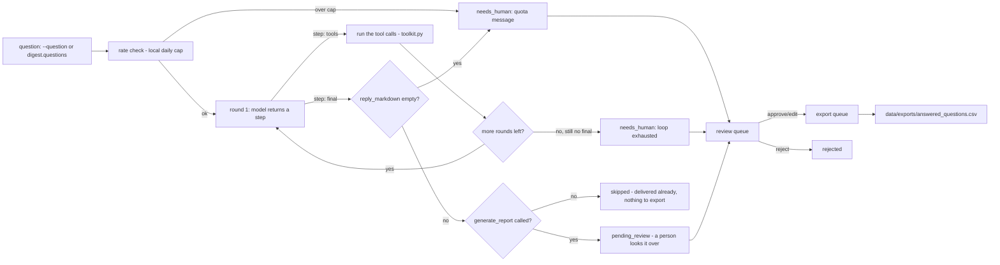

# How Portfolio Analyst AI works

## The loop

Portfolio Analyst AI has no inbox to poll. The trigger is a question, typed
by an owner or manager, so the usual "fetch -> dedup -> decide -> draft ->
queue" shape (ARCHITECTURE.md section 1) becomes **ask -> bounded tool loop
-> log**:

`tools/tool_loop.py:run_tool_loop()` drives the whole thing: one call to
`core.llm.complete()` per round, always against `prompts/schemas/step.json`,
exactly the schema-constrained-JSON technique ARCHITECTURE.md section 3
already documents for the `claude-code`/`anthropic` providers - there is no
native tool-calling in this family's LLM contract, so a hand-rolled loop
drives it, the same way the source system (`jarvis-chat.ts`,
`vps-tool-loop.server.ts` - see `specs/portfolio-analyst-ai.md`) does. Seven
tools, all in `tools/toolkit.py`, all pure functions over the property's own
data - no eighth tool writes anything, which is the whole of "it doesn't
change rates or settings" (the roster's own words): there is no PMS-write,
POS or accounting-write tool for the model to reach for.

`tools/engine.py:answer_question()` is the whole thing for one question,
shared by `tools/run.py` (real use), `tools/digest.py` (the morning
briefing) and `tools/demo.py` (the fixtures), so all three exercise exactly
the same code path.

## Deciding the outcome

Not a model decision - plain rules in `tools/engine.py`:

- The tool loop returns a non-empty `reply_markdown` within
  `tool_loop.max_rounds` (default 6, `config/agent.yaml`) and never called
  `generate_report` -> `skipped`. Informational: it was already delivered
  in full to whoever asked, there is nothing to review or export, which is
  the whole point of the roster's "answered in seconds". A clean answer
  that DID call `generate_report` -> `pending_review` instead - a person
  should look at a report before it counts as an audited answer
  (`tools/review.py`). Neither of these is `auto_sent`: that status means a
  guarded write happened autonomously for this one item, and nothing here
  ever does that - see `tools/engine.py:_terminal_status`.
- The loop runs out of rounds without ever returning `"step": "final"`, or
  the model's JSON does not match `prompts/schemas/step.json` -> `needs_human`.
  What was actually tried (`tool_calls`, any `reports`) is kept on
  `payload._last_attempt` so a reviewer sees exactly what the Analyst
  attempted before giving up - `tools/review.py show <id>`.
- The local daily question cap is reached (`rate_limit.max_questions_per_day`)
  -> `needs_human` with a quota message. Fails OPEN: a bug in the counter
  itself never blocks a real question - see `tools/engine.py:check_rate_limit`.

## What runs when

| Workflow | Cadence | Provider used |
|---|---|---|
| `workflows/10-ask.md` (`tools/run.py --question "..."`) | on demand, whenever someone asks | whatever `llm.provider` is set to |
| `workflows/16-digest.md` (`tools/run.py --once --digest`) | `config/agent.yaml: schedule.digest` (07:00 daily by default) | whatever `llm.provider` is set to |
| `workflows/80-review.md` (`tools/review.py`) | whenever a human is available | none - queue operations only |
| `tools/review.py send` | after an approval | none for deciding; the Sheets adapter's `append()` |

`python3 tools/schedule.py --all` prints the cron/launchd/systemd snippet for
every job in `config/agent.yaml: schedule:` with the right command already
filled in - see `workflows/16-digest.md` and `scheduler/`.

## Modes

`shadow` (default): answers, thinks, logs. `generate_report`'s output still
shows up in the chat reply (that is not a write - it is the model's own
answer), but the digest's CSV export is blocked, and nothing reaches
`data/exports/`. `live`: the digest export runs through the Sheets adapter's
`sheets_write` action - not on `review.require_approval_for` by default,
because a local CSV export is not guest-facing and does not touch the PMS
(add it to that list in `config/hotel.yaml` if you want a person to approve
each morning's export). See `docs/safety.md`.

## Idempotency

- `core.store.Store.upsert_item(source, external_id, kind="question", ...)`
  is unique on `(source, external_id)`. `answer_question()` only ever acts
  on an item still in the `new` status - once an item has left `new`
  (`skipped`/`pending_review` because it answered cleanly, or `needs_human`
  because a person now owns it), a repeat call with the same external id is
  a no-op that returns the existing row untouched. This is deliberately
  stricter than Hello Desk's own "retry the pending stage" pattern: the
  shared `review_status` FSM (`core/store.py`) only allows a **human** to
  move an item out of `needs_human` or `pending_review` (approve/edit/
  reject), so an agent silently re-attempting one after it reached that
  status would be an illegal state transition, not a genuine resume.
- `--dry-run` computes the identical tool loop but writes nothing at all: no
  `items` row, no `events` row (the LLM usage log), no rate-limit counter
  bump, and - through the normal write guard - no export file either. Two
  `--dry-run` passes over the same question never collide, because neither
  one writes a row in the first place. See `tools/engine.py:answer_question`.
- The digest's export claims rows via `Store.claim_for_send()` (an atomic
  conditional UPDATE), so two runners racing on the same queue can never
  both export the same answer.

## Design decisions where the spec was open

`specs/portfolio-analyst-ai.md` section 11 lists eleven honest gaps in the
source system this was ported from. Decisions taken here:

1. **The name.** The roster promises "your whole portfolio's data" and a
   ROAS/multi-property example question, but every tool in the source system
   queries a single property. This template does not pretend otherwise: it
   is a single-property analyst, matching what every tool here actually
   does. A real multi-property build would add `compare_properties` /
   `get_portfolio_summary` tools reading a `portfolio_daily`-shaped export;
   nothing here blocks that, but nothing here fakes it either.
2. **No ROAS, no marketing spend.** There is no eighth tool for ad
   performance, because there is no connected data source for it in a
   standalone template. `fixtures/inbound/question-05-marketing-spend.json`
   is deliberately an escalation fixture: the Analyst tries
   `search_knowledge_base` several ways, finds nothing, and queues the
   question as `needs_human` rather than guess - see `docs/safety.md`.
3. **"Runs its own analysis scripts"** is, honestly, seven fixed,
   hand-written tools, same as the source system. Nothing here executes
   arbitrary SQL. A question outside their shape (see point 2) escalates.
4. **Tool count is 7, stated plainly** (the source brief said 6; the source
   code has 7) - `tools/toolkit.py:TOOL_SPECS`.
5. **"Board-ready PDFs"** is, honestly, a Markdown report card
   (`generate_report`) exported to CSV/Markdown via the Sheets adapter, not
   a rendered PDF document - there is no branded-document renderer in
   `core/`. `docs/benefits.md` and the README say this plainly.
6. **The persona name.** The source system's demo nicknames this persona
   "Jarvis"; this template calls it "the Analyst" (`config/agent.yaml:
   persona.name`), matching the roster nickname, so nothing in a public
   template trades on a name that is not TH1's own product naming.
7. **`list_reservations` is capped and now says so.** The source system's
   25-row cap had no `truncated` flag and no ordering on three of six
   windows - the worst failure mode for an agent instructed never to invent
   figures. Every window here is sorted and returns `count`, `returned` and
   `truncated` - see `tools/toolkit.py:list_reservations`.
8. **The financial ledger, guest-email snapshot and agent-fleet snapshot are
   CSV/JSON, not a live database query.** `core/adapters/base.py` has no
   daily-ledger, cross-agent or fleet-telemetry interface, and inventing one
   would either duplicate the PMS interface badly or invent a fake "portfolio
   database" adapter this repo cannot actually connect to anything. CSV-first
   matches the family's own `pms_csv` convention - see `docs/integrations.md`
   and `tools/data.py`.
9. **The conversation is persisted**, on purpose, as an improvement over the
   source system (its own section 11 point 10 calls the lack of an audit
   trail a governance gap for a finance-department agent). Every question
   becomes an `items` row; nothing about answering a question requires this,
   but reviewing what the Analyst told an owner does.
10. **`hotel.languages` reply-language guardrail does not apply here** the
    way it does for a guest-facing agent (ARCHITECTURE.md/build-repo.md).
    This agent never sends to anyone - there is no email/message adapter in
    its own write path at all, guest-facing or otherwise. If a manager
    pastes an Analyst answer into a guest-facing reply themselves, that is
    their own front-desk workflow's guardrail to enforce, not this one's.

## Where core stops and this agent starts

Everything in `core/` is byte-identical to `factory/core/` and shared by
every repo in the family. Everything in `tools/`, `prompts/`, `fixtures/`,
`workflows/`, and `config/agent.example.yaml` is this agent's own.
